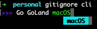
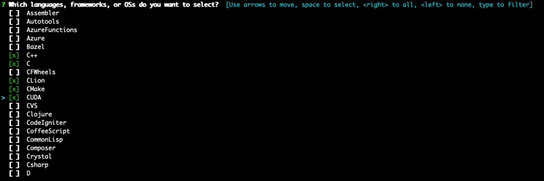
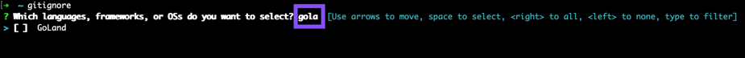

# gitignore

gitignore is a command line application that enables us to create `.gitignore` files in terminal. 

## Install

```shell
git clone https://github.com/gozeloglu/gitignore.git
cd gitignore
go build -o ~/go/bin/gitignore cmd/*
```

After you run these commands, you will be able to run `gitignore`. You may change the target file location(`~/go/bin/gitignore`) with your 
preference.

## Usage

```shell
gitignore cli
```
It opens a new prompt to write technologies by helping auto-complete feature. Type and select option by tab button.



```shell
>>> Go GoLand macOS 
```

```shell
gitignore
```
It opens multiselect prompt to select technologies. You can also type and select if you don't want to traverse whole list.
```shell
  [ ]  Fortran
  [ ]  Git
  [ ]  GitBook
  [x]  Go
  [x]  GoLand
  [ ]  Gradle
  [ ]  Groovy
  [ ]  Haskell
  [ ]  Helm
> [x]  Hugo
```



It suggests when you type something.



## LICENSE
[MIT](LICENSE)